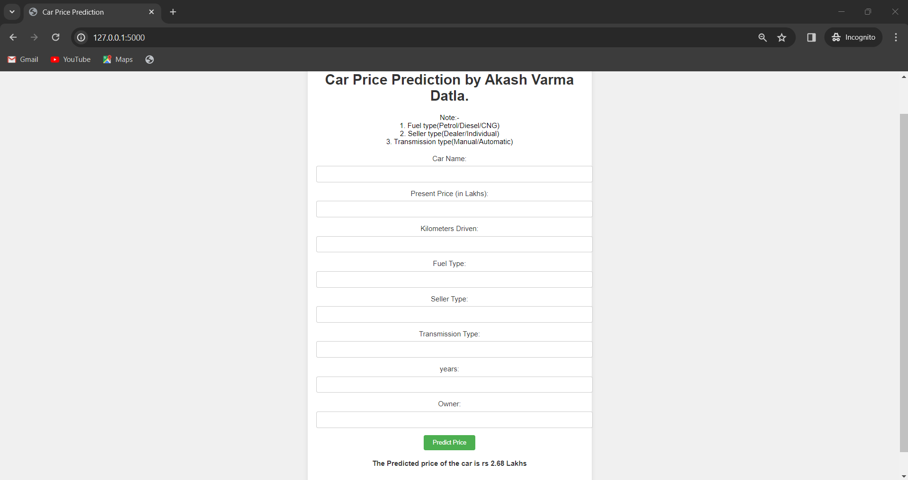

# Car-Price-Prediction
Car price prediction using ExtraTreesRegressor and building an app.      

You can use this to create create environment   
```
conda create -p venv -y
```
         
You can use this to activate env      
```
conda activate venv/
```      
    
You can use this to install requirements
```
pip install -r requirements.txt
```     
     
       
       
                  
GIT COMMANDS     
    
Use this to configure git account
```
git config --global user.name      
git config --global user.email
```
Use this to add files
```
git add .
```
To check files use
```
git status
```
Commit files using 
```
git commit -m "message"
```
To git push use
```
git push origin main
```
    
     
     
      
Use this to run flask app and copy the local url.
```
python app.py
```

Webapp:-    

       

